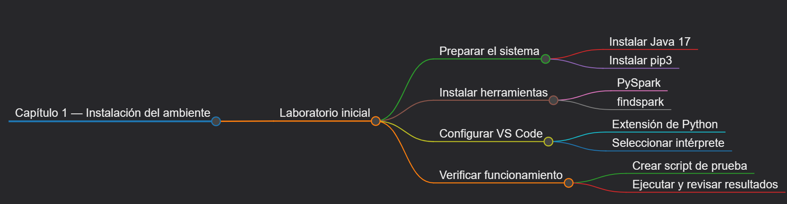
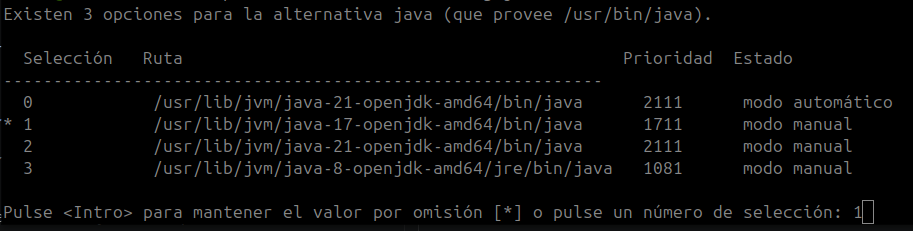
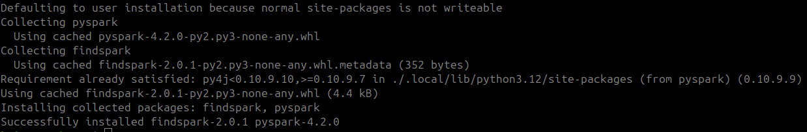
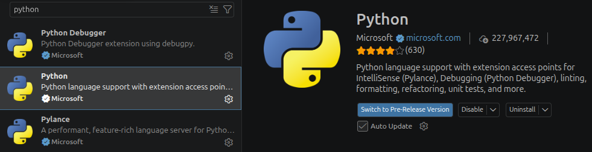
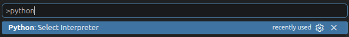
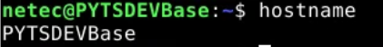
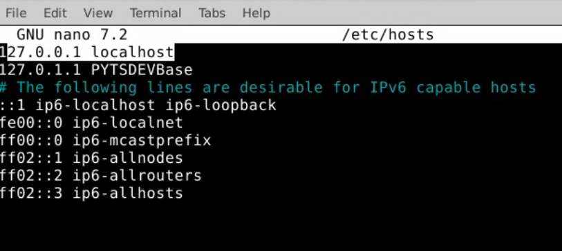
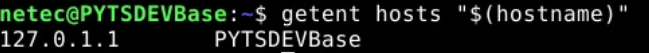
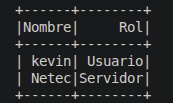

## Práctica 2. Instalación de ambiente para Spark, Python y bibliotecas

### Objetivo

Al finalizar la práctica, el estudiante sera capaz de configurar un entorno moderno de PySpark en Linux Ubuntu y ejecutar scripts de Big Data utilizando el IDE Visual Studio Code.


### Objetivo visual



### Duración aproximada

* 20 minutos.

### Prerrequisitos

* Acceso a un entorno Linux Ubuntu 24.04 (local o virtual) con interfaz gráfica.
* Conexión a internet.

---

### Instrucciones

### Tarea 1. Instalar prerrequisitos del sistema (Java 17 y Pip3)

Las versiones modernas de Apache Spark requieren componentes actualizados de Java y el gestor de paquetes de Python.

#### Paso 1. Instalar Java Development Kit (JDK 17)

Abrir una ventana de terminal (`Ctrl + Alt + T`) e instala Java 17 ejecutando el siguiente comando:

```bash
sudo apt update && sudo apt install -y openjdk-17-jdk
```

#### Paso 2. Configurar Java 17 como predeterminado

Para asegurar que el sistema operativo priorice esta versión, ejecutar:

```bash
sudo update-alternatives --config java
```

*Si aparece una lista de opciones, escribir el número correspondiente a `java-17-openjdk-amd64` y presionar **Enter**.*




#### Paso 3. Instalar PIP3

Instalar las herramientas de empaquetado de Python ejecutando:

```bash
sudo apt install -y python3-pip
```
---

### Tarea 2. Instalación directa de PySpark y FindSpark

Ya no es necesario descargar manualmente archivos `.tgz` de la web de Apache ni configurar variables de entorno en el archivo `.bashrc`.<br>
PySpark se instalará de manera directa y aislada para tu usuario.

#### Paso 4. Descargar las bibliotecas mediante PIP3

Ejecutar el siguiente comando en la terminal utilizando la bandera `--break-system-packages` para cumplir con las normativas de seguridad de los Linux modernos (PEP 668):

```bash
pip3 install pyspark findspark --break-system-packages
```



---
### Tarea 3. Configuración del entorno de desarrollo en VS Code

Se usará Visual Studio Code para escribir y ejecutar de forma visual nuestros scripts de datos.

#### Paso 5. Preparar la extensión de Python

1. Abrir **Visual Studio Code**.
2. Ir a la sección de **Extensiones** en la barra lateral izquierda (o presiona `Ctrl + Shift + X`).
3. Buscar **Python** (desarrollada por Microsoft) y hacer clic en **Instalar**.




#### Paso 6. Seleccionar el Intérprete de Python adecuado

Para evitar errores de importación de librerías dentro del editor:

1. Abrir la carpeta de trabajo en VS Code.
2. Presionar la combinación de teclas **`Ctrl + Shift + P`** para abrir la paleta de comandos.
3. Escribir y seleccionar **`Python: Select Interpreter`**.
4. Elegir el intérprete global del sistema (usualmente listado como `/usr/bin/python3` o **Python 3.12.x**).



---

### Tarea 4. Configuración de la resolución local del nombre del equipo

Spark necesita resolver correctamente el nombre de la máquina hacia una dirección IP local. Para ello, se agregará el hostname del sistema al archivo */etc/hosts*.

#### Paso 7. Obtener el nombre del equipo

Ejecuta el siguiente comando:

    hostname

Copia el resultado en un bloc de notas.

    Por ejemplo:
        PYTSDEVBase




#### Paso 8. Agregar el hostname al archivo `/etc/hosts`

Abre el archivo `/etc/hosts` con permisos administrativos:

```bash
sudo nano /etc/hosts
```

Debajo de la línea:

```text
127.0.0.1 localhost
```

agrega una nueva línea con la dirección `127.0.1.1`, seguida del nombre obtenido en el paso anterior.

Por ejemplo:

```text
127.0.0.1 localhost
127.0.1.1 PYTSDEVBase
```




> **Importante:** Sustituye `PYTSDEVBase` por el resultado obtenido al ejecutar el comando `hostname`.

Para guardar los cambios en Nano, presiona en orden:

1. `Ctrl + O`
2. `Enter`
3. `Ctrl + X`

Verifica que el nombre del equipo se resuelva correctamente:

```bash
getent hosts "$(hostname)"
```

El resultado debe ser similar a:

```text
127.0.1.1 PYTSDEVBase
```



### Tarea 5. Estructura del código base

#### Paso 9. Creación y ejecución del script de verificación

Para validar que Python puede iniciar Spark y procesar datos correctamente, se creará un flujo mínimo mediante un DataFrame.

Crea un archivo llamado `prueba_spark.py` en tu directorio de trabajo y pega el siguiente código:

> **Importante:** El script establece la ruta de Java 17, inicializa Spark mediante `findspark` y crea una sesión local que utiliza los núcleos disponibles del equipo.

```python
import os
import socket
import getpass

# Definir la ruta de Java 17
os.environ["JAVA_HOME"] = "/usr/lib/jvm/java-17-openjdk-amd64"

import findspark
findspark.init()

from pyspark.sql import SparkSession

# Obtener datos del entorno
nombre_maquina = socket.gethostname()
usuario_actual = getpass.getuser()

# Crear una sesión local de Spark
spark = (
    SparkSession.builder
    .appName("ValidacionNetec")
    .master("local[*]")
    .getOrCreate()
)

print("\n" + "=" * 40)
print(f"Versión de Spark detectada: {spark.version}")
print("=" * 40 + "\n")

# Crear los datos de prueba
datos = [
    (usuario_actual, "Usuario"),
    (nombre_maquina, "Servidor")
]

columnas = ["Nombre", "Rol"]

# Crear y mostrar el DataFrame
df = spark.createDataFrame(datos, columnas)

df.show(truncate=False)

# Finalizar la sesión de Spark
spark.stop()
```

#### Paso 10. Ejecución

Hacer clic en el botón de **Play (▶)** ubicado en la esquina superior derecha de VS Code.

---

### Resultado esperado

La terminal integrada de VS Code mostrará algunos mensajes de inicialización (`WARN`) seguidos de la confirmación de la versión y la estructura de datos procesada exitosamente por el clúster local:


